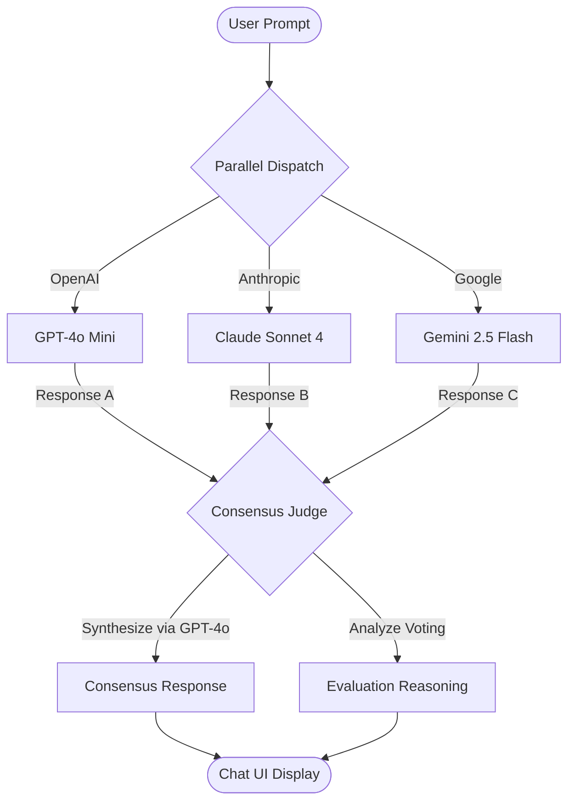

# Self-Consistency GPT

An advanced full-stack AI application implementing the **Self-Consistency (Sample-and-Vote)** reasoning method. When a user submits a query, it calls three distinct LLM models in parallel, then uses a capable judge model (OpenAI GPT-4o) to evaluate agreement, reconcile conflicts, and return a single synthesized consensus answer.

---

## How It Works



1. **Parallel Generation**: The prompt is processed simultaneously by **GPT-4o Mini**, **Claude Sonnet 4**, and **Gemini 2.5 Flash**.
2. **Consensus Synthesis**: An OpenAI **GPT-4o** judge analyzes the three responses, identifies core consensus facts, resolves contradictions, and outputs a consolidated final answer.
3. **Reasoning Traceability**: The judge documents its evaluation reasoning (agreements/disagreements/synthesis logic), which is available to the user.

---

## Project Structure

```text
Self consistency GPT/
├── backend/
│   ├── src/
│   │   └── config/
│   │       ├── models.js      # OpenRouter model paths configuration
│   │       └── openRouter.js  # OpenRouter SDK client initialization
│   ├── .env                   # Local credentials (API key)
│   ├── .gitignore             # Backend version control exclusions
│   ├── server.js              # Express app, routing, and consensus orchestrator
│   └── package.json           # Node scripts and dependency manager
├── frontend/
│   ├── src/
│   │   ├── components/        # Chat components (ChatInput, MessageBubble, etc.)
│   │   ├── services/          # API calling module (api.js)
│   │   ├── utils/             # Markdown text parsing utility
│   │   ├── App.jsx            # State management shell
│   │   ├── index.css          # Minimalist dark theme CSS
│   │   └── main.jsx           # App entry point
│   ├── .gitignore             # Frontend version control exclusions
│   ├── index.html             # Main index document
│   └── package.json           # React dependencies
└── README.md                  # This file
```

---

## Getting Started

Make sure you have [Node.js](https://nodejs.org) installed on your machine.

### Step 1: Set Up Backend

1. Navigate to the `backend` folder:
   ```bash
   cd backend
   ```
2. Install dependencies:
   ```bash
   npm install
   ```
3. Create a `.env` file (or update the existing one) with your credentials:
   ```env
   OPENROUTER_API_KEY=your_openrouter_api_key_here
   PORT=5000
   ```
4. Start the server:
   ```bash
   npm start
   ```
   *The server runs on `http://localhost:5000`.*
   *Note: If no valid API key is supplied, the backend runs in **Mock Mode**, simulating the parallel model answers and judge evaluation.*

### Step 2: Set Up Frontend

1. Open a new terminal and navigate to the `frontend` folder:
   ```bash
   cd frontend
   ```
2. Install dependencies:
   ```bash
   npm install
   ```
3. Start the dev server:
   ```bash
   npm run dev
   ```
   *Open [http://localhost:5173](http://localhost:5173) in your browser.*
